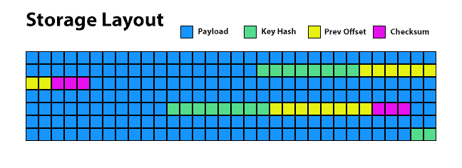

# SIMD R Drive

**Work in progress.**

`SIMD R Drive` is a high-performance storage engine using a single-file storage container optimized for zero-copy binary access.

[Documentation](https://docs.rs/simd-r-drive/latest/simd_r_drive/)

## Table of Contents

- [Zero-Copy Memory-Mapped Access](#zero-copy-memory-mapped-access)
- [Single-File Storage Container for Binary Data](#single-file-storage-container-for-binary-data)
  - [Nestable Storage (Recursive Embedding)](#nestable-storage-recursive-embedding)
  - [No Assumptions About Your Data or Resource-Wasting Serialization Overhead](#no-assumptions-about-your-data-or-resource-wasting-serialization-overhead)
  - [No Predefined Schemas](#no-predefined-schemas)
  - [High-Performance Append-Only Design](#high-performance-append-only-design)
    - [Storage Validation Chain](#storage-validation-chain)
    - [Optimized Metadata Storage & Automatic Recovery](#optimized-metadata-storage--automatic-recovery)
    - [Hardware Accelerated, Automated Indexing](#hardware-accelerated-automated-indexing)
- [Thread Safety and Concurrency Handling](#thread-safety-and-concurrency-handling)
    - [Safe vs. Not Safe](#safe-vs-not-safe)
    - [Thread Safety Matrix](#thread-safety-matrix)
- [Multiple Write Modes](#multiple-write-modes)
  - [Single Entry](#single-entry)
  - [Batch Entry](#batch-entry)
  - [Streaming](#streaming)
- [Multiple Read Modes](#multiple-read-modes)
  - [Direct memory access](#direct-memory-access)
  - [Streaming](#streaming)
- [SIMD Write & Query Acceleration](#simd-write--query-acceleration)

## Zero-Copy Memory-Mapped Access

`SIMD R Drive` is a schema-less, append-only binary storage engine designed for high-performance runtime read/write access. It provides zero-copy reads by memory-mapping the storage file (`mmap`), allowing direct data access without additional deserialization.

Unlike `FlatBuffers`, which also supports zero-copy reads but requires predefined schemas, `SIMD R Drive` operates without IDLs or schemas, enabling flexible, raw binary storage optimized for real-time applications.

Additionally, `SIMD R Drive` is designed to handle datasets larger than available RAM by leveraging memory mapping. The system transparently accesses only the necessary portions of the file, reducing memory pressure and enabling efficient storage operations on large-scale datasets.

## Single-File Storage Container for Binary Data

- Stores any binary format without interpretation or modification.

- Treats payloads as raw bytes (`&[u8]`) for maximum flexibility.

- No enforced endianness or serialization—applications must handle encoding/decoding.

### Nestable Storage (Recursive Embedding)

Since `SIMD R Drive` stores raw binary data, it can also store instances of itself, enabling recursive embedding.

A storage file can be read as a stream and nested within another instance. While unconventional, this demonstrates its extreme flexibility.

Taking it further, an application binary can be stored as raw bytes inside the container, which is then nested within itself.

Upon unpacking, the original binary remains fully intact and executable—allowing it to be retrieved and run again after adjusting file permissions.

### No Assumptions About Your Data or Resource-Wasting Serialization Overhead

This storage engine is intentionally designed as a low-level library, meaning it does not interpret or modify stored data. The payload is treated as raw bytes (`&[u8]`), ensuring that data is stored and retrieved exactly as written. This approach provides maximum flexibility, allowing users to store arbitrary binary formats without constraints.

`SIMD R Drive` does not enforce endianness or serialization formats, leaving these concerns to the application. If an application requires a specific encoding (e.g., little-endian numbers), it must explicitly convert the data before storing it and decode it after retrieval. This design ensures optimal performance while avoiding unnecessary overhead from automatic transformations.

By focusing solely on efficient data storage and retrieval, `SIMD R Drive` provides a lightweight and flexible foundation for applications that require high-speed access to structured or unstructured binary data without the complexity of schema management.

### No Predefined Schemas

`SIMD R Drive` is fully append-only, ensuring that only the most recent version of each data point is retrieved during queries.

While the storage file grows continuously, the library provides explicit compaction to reduce file size when needed.

Metadata is stored at the end of each payload, minimizing disk seeks and enabling efficient integrity checks.

Think of it as a self-contained binary filesystem—capable of storing and retrieving any data format without predefined schemas.

### High-Performance Append-Only Design

- Uses sequential, append-based writes to minimize disk overhead.

- Ensures high write throughput, ideal for real-time workloads.

  

#### Storage Validation Chain

Each payload is immediately followed by a metadata entry containing previous offsets, hashes, and checksums, forming a linked chain that can be efficiently traversed from the end of the file to the beginning. This chain is validated on load, ensuring data integrity while remaining extremely fast.

This design allows seamless nesting of storage containers within other containers without requiring any byte manipulation inside the nested structures.

Additionally, it serves as a recovery mechanism, detecting incomplete writes caused by unexpected interruptions. If an entry is found to be partially written, it is automatically discarded to prevent file corruption.

Because metadata is appended after each payload, there is no unnecessary seeking. When a file is opened, the system reads the metadata from the end and reconstructs the entire chain back to byte 0. A chain is only considered valid if it can be walked back to byte 0 without gaps. If the last chain is incomplete, the system automatically scans backward until a fully valid chain is found—ensuring consistent data recovery, even in storage containers larger than RAM.

#### Optimized Metadata Storage & Automatic Recovery

- Metadata is appended at the end of payloads, reducing unnecessary disk seeks.

- Built-in integrity verification detects incomplete writes.

- Automatically recovers from partially written or corrupt files.

#### Hardware Accelerated, Automated Indexing

Content retrieval is optimized using hashed keys, managed internally by a `HashMap` powered by the `xxh3_64` hashing algorithm. This algorithm takes advantage of hardware acceleration where available:

  - SSE2 – Universally supported on x86_64, enabled by default.
  - AVX2 – Offers additional performance gains on capable CPUs.
  - Neon – Default on aarch64 targets, providing SIMD acceleration.

This indexing system works seamlessly with memory-mapped (`mmap`) pages, enabling high-speed random access. Benchmarks show that 1 million random seeks, retrieving 8-byte entries, typically complete in well under 1 second, demonstrating reasonable query performance.

As content is added, the memory-mapped pages and the indexing are synchronized between threads in a multi-threaded application.

## Thread Safety and Concurrency Handling

`SIMD R Drive` supports concurrent access using a combination of **read/write locks (`RwLock`)**, **atomic operations (`AtomicU64`)**, and **reference counting (`Arc`)** to ensure safe access across multiple threads. 

- **Reads are zero-copy and lock-free**: Since entries are read directly from a memory-mapped file (`mmap`), multiple threads can safely perform reads in parallel without requiring synchronization. The storage structure does not modify entries once written, ensuring safe concurrent reads.
  
- **Writes are synchronized with `RwLock`**: All write operations acquire a **write lock** (`RwLock<File>`), ensuring only one thread can modify the storage file at a time. This prevents race conditions when appending new entries.
  
- **Index updates use `RwLock<HashMap>`**: The in-memory key index is wrapped in an `RwLock<HashMap>` to allow concurrent lookups while ensuring exclusive access during modifications.

- **Memory mapping (`mmap`) is protected by `Mutex<Arc<Mmap>>`**: The memory-mapped file reference is wrapped in a `Mutex<Arc<Mmap>>` to prevent unsafe remapping while reads are in progress. This ensures that readers always have a valid view of the storage file.

- **Atomic offsets ensure correct ordering**: The last written offset (`last_offset`) is managed using `AtomicU64`, avoiding unnecessary locking while ensuring correct sequential writes.

#### Safe vs. Not Safe

The built-in concurrency mechanisms ensure that `SIMD R Drive` can handle concurrent reads and writes safely in a **single-process, multi-threaded** environment.

However, **multiple instances of the application accessing the same file are not synchronized**, meaning external file locking should be used if multiple processes need to coordinate access to the same storage file.

> It is not the intention of this core library to provide multiple instance file locking, outside of a multi-threaded environment running in a single process.

#### Thread Safety Matrix

| **Environment**                     | **Reads** | **Writes** | **Index Updates** | **Storage Safety** |
|--------------------------------------|----------|------------|-------------------|---------------------|
| **Single Process, Single Thread**   | ✅ Safe  | ✅ Safe     | ✅ Safe           | ✅ Safe             |
| **Single Process, Multi-Threaded**  | ✅ Safe (lock-free, zero-copy) | ✅ Safe (`RwLock<File>`) | ✅ Safe (`RwLock<HashMap>`) | ✅ Safe (`Mutex<Arc<Mmap>>`) |
| **Multiple Processes, Shared File** | ⚠️ Unsafe (no cross-process coordination) | ❌ Unsafe (no external locking) | ❌ Unsafe (separate memory spaces) | ❌ Unsafe (risk of race conditions) |

**Legend**

- ✅ **Safe for single-process, multi-threaded workloads** thanks to `RwLock`, `Mutex`, and `AtomicU64`.
- ⚠️ **Not safe for multiple processes sharing the same file** unless an external file locking mechanism is used.
- **If multiple instances need to access the same file, external locking (e.g., `flock`, advisory locking) is required** to prevent corruption.

## Multiple Write Modes

Write data using different methods optimized for various use cases.

### Single Entry

Writes a single key-value pair to the storage in an atomic operation.  Write are immediately flushed to disk.

### Batch Entry

Writes multiple key-value pairs in a single locked operation, reducing disk I/O overhead, as writes are flushed to disk at the end of the batch.

### Streaming

Writes large data entries using a streaming `Read` source, without requiring full in-memory allocation.

## Multiple Read Modes

Read data using different retrieval methods based on performance and memory needs.

### Direct memory access

Retrieves stored data using zero-copy memory mapping (`mmap`), allowing efficient access without extra allocations.

Large entries can be accessed without full in-memory loading, but reading them as a single slice may increase memory usage.

### Streaming

Reads large entries incrementally, ensuring only small portions are processed at a time.

This avoids high memory overhead while still leveraging `mmap` for efficient access.

> Streaming reads are non-zero-copy since they are read through a buffer.

## SIMD Write & Query Acceleration

`SIMD R Drive` leverages SIMD (Single Instruction, Multiple Data) acceleration to optimize performance in key operations, specifically focusing on **write** operations and indexing efficiency.

- **SIMD-Optimized File Writing (`simd_copy`)**: During write operations, `SIMD R Drive` employs a specialized SIMD-accelerated memory copy function (`simd_copy`) to efficiently transfer data into buffers before writing to disk. This reduces CPU overhead and speeds up bulk writes by leveraging vectorized memory operations instead of relying on standard byte-wise copying. The use of `simd_copy` ensures that data is efficiently staged in memory before being flushed to disk, optimizing write throughput.

- **SIMD-Accelerated Hashing (`xxh3_64`)**: The hashing mechanism used for indexing (`xxh3_64`) is optimized with SIMD extensions. This improves key lookups and indexing efficiency, particularly for large datasets with high query throughput.

By using SIMD for these performance-critical tasks, `SIMD R Drive` minimizes CPU cycles spent on memory movement and hashing, leading to optimized storage performance in high-throughput, write-heavy workloads. Note that **SIMD is not used for reading or zero-copy memory-mapped access**, as those operations benefit from direct memory access without additional transformations.
